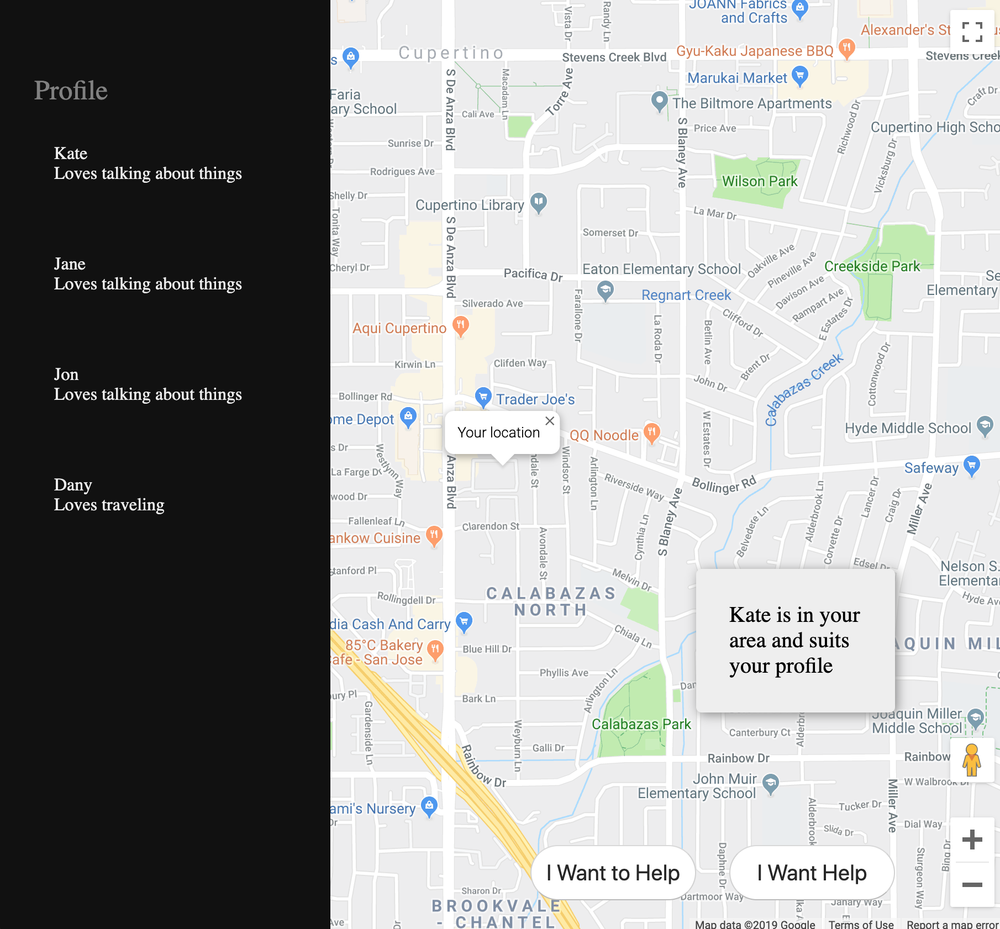

PORCH is a WebApp on NodeJS allowing people with mental health issues reach out to volunteers in their area willing to help them.
We created it during the Hackathon for Mental Health by Twitter and Pubnub. 
I made a working prototype in a matter of hours after we have designed the UX. 
I presented the demo as well.
We were the winners of the event.

Below is the screenshot of the project that we assembled in a few hours.

